# 📊 GUÍA DE MONITOREO Y ALERTAS - TuAppDeAccesorios

**Guía completa de monitoreo operacional y alertas para entorno de producción**

---

## 🎯 **RESUMEN EJECUTIVO**

### **Estado: Sistema de Monitoreo Enterprise** 🏆
- ✅ **Security Monitoring** - Detección de amenazas en tiempo real
- ✅ **Application Monitoring** - Métricas de rendimiento y salud
- ✅ **Infrastructure Monitoring** - Recursos y disponibilidad
- ✅ **Multi-channel Alerts** - Email, Slack, Discord
- ✅ **Real-time Dashboard** - Visualización en tiempo real

---

## 🏗️ **ARQUITECTURA DE MONITOREO**

### **Stack de Monitoreo**

```mermaid
graph TB
    App[🐍 FastAPI App] --> Metrics[📊 Metrics Collection]
    App --> Logs[📝 Structured Logs]
    App --> Traces[🔍 Distributed Tracing]
    
    Metrics --> Prometheus[📈 Prometheus]
    Logs --> ELK[🔍 ELK Stack]
    Traces --> Jaeger[🌐 Jaeger]
    
    Prometheus --> Grafana[📊 Grafana Dashboards]
    ELK --> Kibana[🔍 Kibana Dashboards]
    
    Grafana --> Alerts[🚨 AlertManager]
    Alerts --> Email[📧 Email]
    Alerts --> Slack[💬 Slack]
    Alerts --> Discord[🗣️ Discord]
    
    subgraph "External Services"
        Render[🌐 Render Metrics]
        Cloudflare[☁️ Cloudflare Analytics]
        Sentry[🐛 Sentry Error Tracking]
    end
```


---

## 📊 **MÉTRICAS DE APLICACIÓN**

### **Métricas de Rendimiento**
```python
# app/monitoring/metrics.py
from prometheus_client import Counter, Histogram, Gauge, start_http_server
import time
from functools import wraps

# Contadores básicos
REQUEST_COUNT = Counter(
    'http_requests_total',
    'Total HTTP requests',
    ['method', 'endpoint', 'status']
)

REQUEST_DURATION = Histogram(
    'http_request_duration_seconds',
    'HTTP request duration',
    ['method', 'endpoint']
)

ACTIVE_CONNECTIONS = Gauge(
    'active_connections_total',
    'Active database connections'
)

# Métricas de seguridad
SECURITY_EVENTS = Counter(
    'security_events_total',
    'Security events detected',
    ['event_type', 'severity']
)

RATE_LIMIT_VIOLATIONS = Counter(
    'rate_limit_violations_total',
    'Rate limit violations',
    ['endpoint', 'ip']
)

AUTHENTICATION_ATTEMPTS = Counter(
    'authentication_attempts_total',
    'Authentication attempts',
    ['status', 'method']
)

# Métricas de negocio
SALES_TRANSACTIONS = Counter(
    'sales_transactions_total',
    'Total sales transactions',
    ['store_type']
)

INVENTORY_UPDATES = Counter(
    'inventory_updates_total',
    'Inventory update operations',
    ['operation_type']
)

USER_SESSIONS = Gauge(
    'active_user_sessions',
    'Active user sessions'
)

def track_time(metric: Histogram):
    """Decorador para medir tiempo de ejecución"""
    def decorator(func):
        @wraps(func)
        async def wrapper(*args, **kwargs):
            start_time = time.time()
            try:
                result = await func(*args, **kwargs)
                metric.observe(time.time() - start_time)
                return result
            except Exception as e:
                metric.observe(time.time() - start_time)
                raise
        return wrapper
    return decorator

@track_time(REQUEST_DURATION.labels(method="GET", endpoint="/api/products"))
async def get_products():
    # Implementación del endpoint
    pass
```

### **Configuración FastAPI con Métricas**
```python
# app/middleware/metrics_middleware.py
from fastapi import Request, Response
from starlette.middleware.base import BaseHTTPMiddleware
import time

class MetricsMiddleware(BaseHTTPMiddleware):
    async def dispatch(self, request: Request, call_next):
        start_time = time.time()
        
        # Procesar request
        response = await call_next(request)
        
        # Registrar métricas
        duration = time.time() - start_time
        
        REQUEST_COUNT.labels(
            method=request.method,
            endpoint=request.url.path,
            status=response.status_code
        ).inc()
        
        REQUEST_DURATION.labels(
            method=request.method,
            endpoint=request.url.path
        ).observe(duration)
        
        # Detectar respuestas lentas
        if duration > 2.0:  # 2 segundos
            SLOW_REQUESTS.labels(
                endpoint=request.url.path
            ).inc()
        
        return response

# Endpoint para métricas
@app.get("/metrics")
async def get_metrics():
    from prometheus_client import generate_latest, CONTENT_TYPE_LATEST
    return Response(
        generate_latest(),
        media_type=CONTENT_TYPE_LATEST
    )
```

---

## 🔐 **MONITOREO DE SEGURIDAD**

### **Security Dashboard en Tiempo Real**
```python
# app/api/security_dashboard.py
from fastapi import APIRouter, Depends, HTTPException
from app.security.security_monitor import security_monitor
from app.auth.dependencies import require_admin

router = APIRouter(prefix="/api/security", tags=["security"])

@router.get("/dashboard")
async def get_security_dashboard(current_user=Depends(require_admin)):
    """Dashboard de seguridad en tiempo real"""
    
    # Obtener métricas de las últimas 24 horas
    now = datetime.utcnow()
    yesterday = now - timedelta(days=1)
    
    dashboard_data = {
        "summary": {
            "total_requests": await get_total_requests(yesterday, now),
            "blocked_requests": await get_blocked_requests(yesterday, now),
            "threat_events": await get_threat_events(yesterday, now),
            "active_sessions": await get_active_sessions(),
            "failed_logins": await get_failed_logins(yesterday, now)
        },
        "threats": {
            "sql_injection_attempts": await get_sql_injection_count(yesterday, now),
            "xss_attempts": await get_xss_attempts_count(yesterday, now),
            "brute_force_attempts": await get_brute_force_count(yesterday, now),
            "rate_limit_violations": await get_rate_limit_violations(yesterday, now)
        },
        "top_blocked_ips": await get_top_blocked_ips(yesterday, now, limit=10),
        "recent_alerts": await security_monitor.get_recent_alerts(limit=20),
        "geographic_threats": await get_geographic_threat_distribution(yesterday, now)
    }
    
    return dashboard_data

@router.get("/alerts")
async def get_security_alerts(
    severity: Optional[str] = None,
    limit: int = 50,
    current_user=Depends(require_admin)
):
    """Obtener alertas de seguridad"""
    return await security_monitor.get_alerts(
        severity=severity,
        limit=limit
    )

@router.get("/metrics/real-time")
async def get_realtime_metrics(current_user=Depends(require_admin)):
    """Métricas de seguridad en tiempo real"""
    return {
        "requests_per_minute": await get_rpm_metric(),
        "threat_score": await calculate_threat_score(),
        "active_threats": await get_active_threats(),
        "system_health": await get_security_health_score()
    }
```

### **Detección de Anomalías**
```python
# app/monitoring/anomaly_detection.py
import numpy as np
from sklearn.ensemble import IsolationForest
from typing import List, Dict, Any
import asyncio

class AnomalyDetector:
    """Detector de anomalías usando ML"""
    
    def __init__(self):
        self.model = IsolationForest(contamination=0.1, random_state=42)
        self.is_trained = False
        self.feature_names = [
            'requests_per_minute',
            'error_rate',
            'response_time_avg',
            'unique_ips',
            'failed_logins',
            'blocked_requests'
        ]
    
    async def collect_metrics(self) -> Dict[str, float]:
        """Recopilar métricas para análisis"""
        now = datetime.utcnow()
        last_minute = now - timedelta(minutes=1)
        
        return {
            'requests_per_minute': await get_requests_count(last_minute, now),
            'error_rate': await get_error_rate(last_minute, now),
            'response_time_avg': await get_avg_response_time(last_minute, now),
            'unique_ips': await get_unique_ips_count(last_minute, now),
            'failed_logins': await get_failed_logins_count(last_minute, now),
            'blocked_requests': await get_blocked_requests_count(last_minute, now)
        }
    
    async def train_model(self, historical_days: int = 30):
        """Entrenar modelo con datos históricos"""
        end_date = datetime.utcnow()
        start_date = end_date - timedelta(days=historical_days)
        
        # Obtener datos históricos por minuto
        training_data = []
        current = start_date
        
        while current < end_date:
            next_minute = current + timedelta(minutes=1)
            metrics = await self.collect_metrics_for_period(current, next_minute)
            training_data.append([metrics[name] for name in self.feature_names])
            current = next_minute
        
        # Entrenar modelo
        X = np.array(training_data)
        self.model.fit(X)
        self.is_trained = True
        
        logger.info(f"Anomaly detection model trained with {len(training_data)} samples")
    
    async def detect_anomaly(self) -> Dict[str, Any]:
        """Detectar anomalías en métricas actuales"""
        if not self.is_trained:
            return {"error": "Model not trained"}
        
        # Obtener métricas actuales
        current_metrics = await self.collect_metrics()
        X = np.array([[current_metrics[name] for name in self.feature_names]])
        
        # Predecir anomalía
        prediction = self.model.predict(X)[0]
        anomaly_score = self.model.decision_function(X)[0]
        
        is_anomaly = prediction == -1
        
        result = {
            "is_anomaly": is_anomaly,
            "anomaly_score": float(anomaly_score),
            "metrics": current_metrics,
            "timestamp": datetime.utcnow().isoformat()
        }
        
        # Generar alerta si es anomalía
        if is_anomaly:
            await self.generate_anomaly_alert(result)
        
        return result
    
    async def generate_anomaly_alert(self, anomaly_data: Dict[str, Any]):
        """Generar alerta de anomalía"""
        alert = {
            "type": "anomaly_detected",
            "severity": "HIGH",
            "title": "Anomalía detectada en métricas del sistema",
            "description": f"El sistema ha detectado un comportamiento anómalo con score: {anomaly_data['anomaly_score']:.3f}",
            "metrics": anomaly_data["metrics"],
            "timestamp": anomaly_data["timestamp"]
        }
        
        await security_monitor.process_alert(alert)

# Instancia global
anomaly_detector = AnomalyDetector()
```

---

## 🚨 **SISTEMA DE ALERTAS**

### **Configuración de Alertas**
```python
# app/monitoring/alerting.py
from typing import Dict, List, Any, Optional
from enum import Enum
import asyncio
import aiohttp
import smtplib
from email.mime.text import MIMEText
from email.mime.multipart import MIMEMultipart

class AlertSeverity(Enum):
    LOW = "LOW"
    MEDIUM = "MEDIUM"
    HIGH = "HIGH"
    CRITICAL = "CRITICAL"

class AlertChannel(Enum):
    EMAIL = "email"
    SLACK = "slack"
    DISCORD = "discord"
    WEBHOOK = "webhook"

class AlertManager:
    """Gestor centralizado de alertas"""
    
    def __init__(self):
        self.channels = {
            AlertChannel.EMAIL: self._send_email_alert,
            AlertChannel.SLACK: self._send_slack_alert,
            AlertChannel.DISCORD: self._send_discord_alert,
            AlertChannel.WEBHOOK: self._send_webhook_alert
        }
        
        # Configuración de canales por severidad
        self.channel_config = {
            AlertSeverity.LOW: [AlertChannel.EMAIL],
            AlertSeverity.MEDIUM: [AlertChannel.EMAIL, AlertChannel.SLACK],
            AlertSeverity.HIGH: [AlertChannel.EMAIL, AlertChannel.SLACK, AlertChannel.DISCORD],
            AlertSeverity.CRITICAL: [AlertChannel.EMAIL, AlertChannel.SLACK, AlertChannel.DISCORD, AlertChannel.WEBHOOK]
        }
    
    async def send_alert(self, alert: Dict[str, Any]):
        """Enviar alerta a través de múltiples canales"""
        severity = AlertSeverity(alert.get("severity", "MEDIUM"))
        channels = self.channel_config.get(severity, [AlertChannel.EMAIL])
        
        # Enviar a todos los canales configurados
        tasks = []
        for channel in channels:
            if channel in self.channels:
                task = self.channels[channel](alert)
                tasks.append(task)
        
        # Ejecutar en paralelo
        if tasks:
            await asyncio.gather(*tasks, return_exceptions=True)
        
        # Registrar en log de alertas
        await self._log_alert(alert)
    
    async def _send_email_alert(self, alert: Dict[str, Any]):
        """Enviar alerta por email"""
        try:
            smtp_host = os.getenv('SMTP_HOST', 'localhost')
            smtp_port = int(os.getenv('SMTP_PORT', '587'))
            smtp_user = os.getenv('SMTP_USER')
            smtp_pass = os.getenv('SMTP_PASSWORD')
            
            if not all([smtp_user, smtp_pass]):
                logger.warning("SMTP credentials not configured")
                return
            
            # Crear mensaje
            msg = MIMEMultipart()
            msg['From'] = smtp_user
            msg['To'] = ", ".join(alert.get('recipients', []))
            msg['Subject'] = f"[{alert['severity']}] {alert['title']}"
            
            # Cuerpo del mensaje
            body = self._format_email_body(alert)
            msg.attach(MIMEText(body, 'html'))
            
            # Enviar
            with smtplib.SMTP(smtp_host, smtp_port) as server:
                server.starttls()
                server.login(smtp_user, smtp_pass)
                server.send_message(msg)
            
            logger.info(f"Email alert sent: {alert['title']}")
            
        except Exception as e:
            logger.error(f"Failed to send email alert: {e}")
    
    async def _send_slack_alert(self, alert: Dict[str, Any]):
        """Enviar alerta a Slack"""
        try:
            webhook_url = os.getenv('SLACK_WEBHOOK_URL')
            if not webhook_url:
                return
            
            # Mapear severidad a colores
            color_map = {
                "LOW": "#36a64f",
                "MEDIUM": "#ff9500",
                "HIGH": "#ff4444",
                "CRITICAL": "#8b0000"
            }
            
            payload = {
                "attachments": [{
                    "color": color_map.get(alert["severity"], "#ff9500"),
                    "title": f"🚨 {alert['title']}",
                    "text": alert["description"],
                    "fields": [
                        {
                            "title": "Severidad",
                            "value": alert["severity"],
                            "short": True
                        },
                        {
                            "title": "Timestamp",
                            "value": alert.get("timestamp", datetime.utcnow().isoformat()),
                            "short": True
                        }
                    ],
                    "footer": "TuAppDeAccesorios Security Monitor",
                    "ts": int(datetime.utcnow().timestamp())
                }]
            }
            
            # Agregar métricas si están disponibles
            if "metrics" in alert:
                metrics_text = "\n".join([
                    f"• {k}: {v}" for k, v in alert["metrics"].items()
                ])
                payload["attachments"][0]["fields"].append({
                    "title": "Métricas",
                    "value": f"```{metrics_text}```",
                    "short": False
                })
            
            async with aiohttp.ClientSession() as session:
                async with session.post(webhook_url, json=payload) as response:
                    if response.status == 200:
                        logger.info(f"Slack alert sent: {alert['title']}")
                    else:
                        logger.error(f"Slack alert failed: {response.status}")
                        
        except Exception as e:
            logger.error(f"Failed to send Slack alert: {e}")
    
    async def _send_discord_alert(self, alert: Dict[str, Any]):
        """Enviar alerta a Discord"""
        try:
            webhook_url = os.getenv('DISCORD_WEBHOOK_URL')
            if not webhook_url:
                return
            
            # Mapear severidad a colores
            color_map = {
                "LOW": 0x36a64f,
                "MEDIUM": 0xff9500,
                "HIGH": 0xff4444,
                "CRITICAL": 0x8b0000
            }
            
            embed = {
                "title": f"🚨 {alert['title']}",
                "description": alert["description"],
                "color": color_map.get(alert["severity"], 0xff9500),
                "timestamp": alert.get("timestamp", datetime.utcnow().isoformat()),
                "fields": [
                    {
                        "name": "Severidad",
                        "value": alert["severity"],
                        "inline": True
                    }
                ],
                "footer": {
                    "text": "TuAppDeAccesorios Security Monitor"
                }
            }
            
            # Agregar métricas
            if "metrics" in alert:
                metrics_text = "\n".join([
                    f"**{k}**: {v}" for k, v in alert["metrics"].items()
                ])
                embed["fields"].append({
                    "name": "Métricas",
                    "value": metrics_text,
                    "inline": False
                })
            
            payload = {"embeds": [embed]}
            
            async with aiohttp.ClientSession() as session:
                async with session.post(webhook_url, json=payload) as response:
                    if response.status == 204:
                        logger.info(f"Discord alert sent: {alert['title']}")
                    else:
                        logger.error(f"Discord alert failed: {response.status}")
                        
        except Exception as e:
            logger.error(f"Failed to send Discord alert: {e}")
    
    def _format_email_body(self, alert: Dict[str, Any]) -> str:
        """Formatear cuerpo del email en HTML"""
        severity_colors = {
            "LOW": "#28a745",
            "MEDIUM": "#ffc107",
            "HIGH": "#fd7e14",
            "CRITICAL": "#dc3545"
        }
        
        color = severity_colors.get(alert["severity"], "#6c757d")
        
        html = f"""
        <html>
        <body style="font-family: Arial, sans-serif;">
            <div style="border-left: 4px solid {color}; padding-left: 20px;">
                <h2 style="color: {color};">{alert['title']}</h2>
                <p><strong>Severidad:</strong> <span style="color: {color};">{alert['severity']}</span></p>
                <p><strong>Descripción:</strong> {alert['description']}</p>
                <p><strong>Timestamp:</strong> {alert.get('timestamp', datetime.utcnow().isoformat())}</p>
        """
        
        if "metrics" in alert:
            html += "<h3>Métricas:</h3><ul>"
            for key, value in alert["metrics"].items():
                html += f"<li><strong>{key}:</strong> {value}</li>"
            html += "</ul>"
        
        html += """
            </div>
            <hr>
            <p style="color: #6c757d; font-size: 12px;">
                Este mensaje fue generado automáticamente por TuAppDeAccesorios Security Monitor.
            </p>
        </body>
        </html>
        """
        
        return html

# Instancia global
alert_manager = AlertManager()
```

---

## 📈 **DASHBOARDS Y VISUALIZACIÓN**

### **Grafana Dashboard Configuration**
```json
{
  "dashboard": {
    "title": "TuAppDeAccesorios - Security & Performance",
    "panels": [
      {
        "title": "Request Rate",
        "type": "graph",
        "targets": [
          {
            "expr": "rate(http_requests_total[5m])",
            "legendFormat": "{{ method }} {{ endpoint }}"
          }
        ]
      },
      {
        "title": "Response Time",
        "type": "graph",
        "targets": [
          {
            "expr": "histogram_quantile(0.95, rate(http_request_duration_seconds_bucket[5m]))",
            "legendFormat": "95th percentile"
          },
          {
            "expr": "histogram_quantile(0.50, rate(http_request_duration_seconds_bucket[5m]))",
            "legendFormat": "50th percentile"
          }
        ]
      },
      {
        "title": "Error Rate",
        "type": "singlestat",
        "targets": [
          {
            "expr": "rate(http_requests_total{status=~\"5..\"}[5m]) / rate(http_requests_total[5m]) * 100",
            "legendFormat": "Error Rate %"
          }
        ]
      },
      {
        "title": "Security Events",
        "type": "graph",
        "targets": [
          {
            "expr": "rate(security_events_total[5m])",
            "legendFormat": "{{ event_type }}"
          }
        ]
      },
      {
        "title": "Active Sessions",
        "type": "singlestat",
        "targets": [
          {
            "expr": "active_user_sessions",
            "legendFormat": "Active Sessions"
          }
        ]
      },
      {
        "title": "Database Connections",
        "type": "singlestat",
        "targets": [
          {
            "expr": "active_connections_total",
            "legendFormat": "Active Connections"
          }
        ]
      }
    ]
  }
}
```

### **Real-time Security Dashboard (HTML)**
```html
<!-- security_dashboard.html -->
<!DOCTYPE html>
<html>
<head>
    <title>TuAppDeAccesorios - Security Dashboard</title>
    <script src="https://cdn.jsdelivr.net/npm/chart.js"></script>
    <script src="https://cdnjs.cloudflare.com/ajax/libs/socket.io/4.0.0/socket.io.js"></script>
    <style>
        body { font-family: Arial, sans-serif; margin: 20px; }
        .dashboard-grid { display: grid; grid-template-columns: repeat(auto-fit, minmax(300px, 1fr)); gap: 20px; }
        .metric-card { border: 1px solid #ddd; border-radius: 8px; padding: 20px; background: #f9f9f9; }
        .metric-value { font-size: 2em; font-weight: bold; }
        .metric-label { color: #666; }
        .alert-high { border-left: 4px solid #ff4444; }
        .alert-medium { border-left: 4px solid #ff9500; }
        .alert-low { border-left: 4px solid #36a64f; }
    </style>
</head>
<body>
    <h1>🛡️ Security Dashboard - TuAppDeAccesorios</h1>
    
    <div class="dashboard-grid">
        <div class="metric-card">
            <div class="metric-label">Requests/Min</div>
            <div class="metric-value" id="requests-per-min">-</div>
        </div>
        
        <div class="metric-card">
            <div class="metric-label">Blocked Requests</div>
            <div class="metric-value" id="blocked-requests">-</div>
        </div>
        
        <div class="metric-card">
            <div class="metric-label">Active Sessions</div>
            <div class="metric-value" id="active-sessions">-</div>
        </div>
        
        <div class="metric-card">
            <div class="metric-label">Threat Score</div>
            <div class="metric-value" id="threat-score">-</div>
        </div>
    </div>
    
    <div style="margin-top: 40px;">
        <h2>📊 Request Rate (Last 10 minutes)</h2>
        <canvas id="requestChart" width="400" height="200"></canvas>
    </div>
    
    <div style="margin-top: 40px;">
        <h2>🚨 Recent Alerts</h2>
        <div id="alerts-container"></div>
    </div>

    <script>
        // WebSocket connection para datos en tiempo real
        const socket = io('/security-dashboard');
        
        // Configurar gráficos
        const ctx = document.getElementById('requestChart').getContext('2d');
        const requestChart = new Chart(ctx, {
            type: 'line',
            data: {
                labels: [],
                datasets: [{
                    label: 'Requests/Min',
                    data: [],
                    borderColor: 'rgb(75, 192, 192)',
                    tension: 0.1
                }]
            },
            options: {
                responsive: true,
                scales: {
                    y: {
                        beginAtZero: true
                    }
                }
            }
        });
        
        // Actualizar métricas en tiempo real
        socket.on('metrics_update', function(data) {
            document.getElementById('requests-per-min').textContent = data.requests_per_min;
            document.getElementById('blocked-requests').textContent = data.blocked_requests;
            document.getElementById('active-sessions').textContent = data.active_sessions;
            document.getElementById('threat-score').textContent = data.threat_score;
            
            // Actualizar gráfico
            const now = new Date().toLocaleTimeString();
            requestChart.data.labels.push(now);
            requestChart.data.datasets[0].data.push(data.requests_per_min);
            
            // Mantener solo últimos 10 puntos
            if (requestChart.data.labels.length > 10) {
                requestChart.data.labels.shift();
                requestChart.data.datasets[0].data.shift();
            }
            
            requestChart.update();
        });
        
        // Mostrar alertas
        socket.on('new_alert', function(alert) {
            const alertsContainer = document.getElementById('alerts-container');
            const alertDiv = document.createElement('div');
            alertDiv.className = `metric-card alert-${alert.severity.toLowerCase()}`;
            alertDiv.innerHTML = `
                <strong>${alert.title}</strong><br>
                <small>${alert.timestamp}</small><br>
                ${alert.description}
            `;
            alertsContainer.insertBefore(alertDiv, alertsContainer.firstChild);
            
            // Mantener solo últimas 5 alertas
            while (alertsContainer.children.length > 5) {
                alertsContainer.removeChild(alertsContainer.lastChild);
            }
        });
        
        // Solicitar datos iniciales
        socket.emit('request_initial_data');
    </script>
</body>
</html>
```

---

## 🔍 **LOGS Y AUDITORÍA**

### **Structured Logging Configuration**
```python
# app/logging_config.py
import logging
import json
from datetime import datetime
from typing import Dict, Any
from pythonjsonlogger import jsonlogger

class SecurityLogFormatter(jsonlogger.JsonFormatter):
    """Formatter personalizado para logs de seguridad"""
    
    def add_fields(self, log_record, record, message_dict):
        super().add_fields(log_record, record, message_dict)
        
        # Agregar timestamp ISO
        log_record['timestamp'] = datetime.utcnow().isoformat()
        
        # Agregar información de contexto
        log_record['service'] = 'tuapp-backend'
        log_record['version'] = '1.0.0'
        
        # Categorizar por tipo de log
        if hasattr(record, 'security_event'):
            log_record['category'] = 'security'
            log_record['event_type'] = record.security_event
        elif hasattr(record, 'audit_event'):
            log_record['category'] = 'audit'
            log_record['event_type'] = record.audit_event
        else:
            log_record['category'] = 'application'

def setup_logging():
    """Configurar logging estructurado"""
    
    # Formatter para logs JSON
    json_formatter = SecurityLogFormatter(
        '%(timestamp)s %(level)s %(name)s %(message)s'
    )
    
    # Handler para archivo de logs
    file_handler = logging.FileHandler('/app/logs/application.log')
    file_handler.setFormatter(json_formatter)
    
    # Handler para consola
    console_handler = logging.StreamHandler()
    console_handler.setFormatter(json_formatter)
    
    # Configurar logger raíz
    root_logger = logging.getLogger()
    root_logger.setLevel(logging.INFO)
    root_logger.addHandler(file_handler)
    root_logger.addHandler(console_handler)
    
    # Logger específico para seguridad
    security_logger = logging.getLogger('security')
    security_logger.setLevel(logging.INFO)
    
    # Logger específico para auditoría
    audit_logger = logging.getLogger('audit')
    audit_logger.setLevel(logging.INFO)

def get_security_logger(name: str):
    """Obtener logger de seguridad"""
    return logging.getLogger(f'security.{name}')

def get_audit_logger(name: str):
    """Obtener logger de auditoría"""
    return logging.getLogger(f'audit.{name}')
```

---

## 📱 **MONITOREO MÓVIL**

### **Configuración de Alertas Móviles**
```python
# app/monitoring/mobile_alerts.py
import requests
from typing import List, Dict, Any

class MobileAlertManager:
    """Gestor de alertas móviles vía push notifications"""
    
    def __init__(self):
        self.fcm_server_key = os.getenv('FCM_SERVER_KEY')
        self.admin_device_tokens = os.getenv('ADMIN_DEVICE_TOKENS', '').split(',')
    
    async def send_push_notification(self, alert: Dict[str, Any]):
        """Enviar notificación push a dispositivos móviles"""
        
        if not self.fcm_server_key or not self.admin_device_tokens:
            return
        
        # Configurar mensaje push
        payload = {
            "registration_ids": self.admin_device_tokens,
            "notification": {
                "title": f"🚨 {alert['severity']} Alert",
                "body": alert['title'],
                "icon": "security_alert",
                "click_action": "OPEN_DASHBOARD"
            },
            "data": {
                "alert_id": alert.get('id'),
                "severity": alert['severity'],
                "timestamp": alert.get('timestamp'),
                "type": "security_alert"
            }
        }
        
        headers = {
            "Authorization": f"key={self.fcm_server_key}",
            "Content-Type": "application/json"
        }
        
        try:
            async with aiohttp.ClientSession() as session:
                async with session.post(
                    "https://fcm.googleapis.com/fcm/send",
                    json=payload,
                    headers=headers
                ) as response:
                    if response.status == 200:
                        logger.info("Push notification sent successfully")
                    else:
                        logger.error(f"Push notification failed: {response.status}")
                        
        except Exception as e:
            logger.error(f"Failed to send push notification: {e}")

# Instancia global
mobile_alert_manager = MobileAlertManager()
```

---

## 🚀 **COMANDOS OPERACIONALES**

### **Scripts de Monitoreo**
```bash
#!/bin/bash
# monitoring_check.sh

echo "🔍 TuAppDeAccesorios - Health Check"
echo "=================================="

# Check application health
echo "📊 Application Health:"
curl -s http://localhost:8000/health | jq .

# Check metrics endpoint
echo -e "\n📈 Metrics Status:"
curl -s http://localhost:8000/metrics | head -5

# Check security dashboard
echo -e "\n🛡️ Security Status:"
curl -s -H "Authorization: Bearer $ADMIN_TOKEN" http://localhost:8000/api/security/dashboard | jq .summary

# Check database connectivity
echo -e "\n🗄️ Database Status:"
curl -s http://localhost:8000/health/db | jq .

# Check Redis connectivity
echo -e "\n🔴 Redis Status:"
curl -s http://localhost:8000/health/redis | jq .

# Check recent alerts
echo -e "\n🚨 Recent Alerts:"
curl -s -H "Authorization: Bearer $ADMIN_TOKEN" http://localhost:8000/api/security/alerts?limit=5 | jq .

echo -e "\n✅ Health check completed"
```

### **Alert Testing Script**
```bash
#!/bin/bash
# test_alerts.sh

echo "🧪 Testing Alert System"
echo "======================"

# Test email alerts
echo "📧 Testing email alerts..."
curl -X POST http://localhost:8000/api/admin/test-alert \
  -H "Content-Type: application/json" \
  -H "Authorization: Bearer $ADMIN_TOKEN" \
  -d '{"type": "email", "severity": "MEDIUM"}'

# Test Slack alerts
echo "💬 Testing Slack alerts..."
curl -X POST http://localhost:8000/api/admin/test-alert \
  -H "Content-Type: application/json" \
  -H "Authorization: Bearer $ADMIN_TOKEN" \
  -d '{"type": "slack", "severity": "HIGH"}'

# Test Discord alerts
echo "🗣️ Testing Discord alerts..."
curl -X POST http://localhost:8000/api/admin/test-alert \
  -H "Content-Type: application/json" \
  -H "Authorization: Bearer $ADMIN_TOKEN" \
  -d '{"type": "discord", "severity": "LOW"}'

echo "✅ Alert tests completed"
```

---

## 📊 **MÉTRICAS CLAVE (KPIs)**

### **Performance KPIs**
- **Response Time P95**: < 500ms
- **Response Time P99**: < 1s
- **Error Rate**: < 1%
- **Uptime**: > 99.9%
- **Database Query Time**: < 100ms

### **Security KPIs**
- **Threat Detection Rate**: > 95%
- **False Positive Rate**: < 5%
- **Alert Response Time**: < 5 minutos
- **Blocked Attack Rate**: 100%
- **Security Test Coverage**: > 90%

### **Business KPIs**
- **Active Users**: Daily/Monthly
- **Transaction Success Rate**: > 99%
- **Inventory Accuracy**: > 98%
- **System Availability**: > 99.9%

---

## 🔮 **ROADMAP DE MEJORAS**

### **Próximas implementaciones**
- [ ] **Machine Learning Monitoring** - Detección predictiva de problemas
- [ ] **Distributed Tracing** - Trazabilidad completa de requests
- [ ] **Custom Metrics** - Métricas específicas del negocio
- [ ] **Automated Remediation** - Respuesta automática a problemas
- [ ] **Performance Profiling** - Análisis detallado de rendimiento
- [ ] **Capacity Planning** - Predicción de necesidades de recursos

---

**📋 Documento actualizado: 2024-01-07**

*Este sistema de monitoreo proporciona visibilidad completa de la aplicación y permite respuesta rápida a incidentes de seguridad y rendimiento.*