# 🛡️ ARQUITECTURA DE SEGURIDAD - TuAppDeAccesorios

**Documentación completa de la arquitectura de seguridad enterprise implementada**

---

## 🎯 **RESUMEN EJECUTIVO**

TuAppDeAccesorios implementa una **arquitectura de seguridad en capas (Defense in Depth)** que proporciona protección enterprise-level contra amenazas modernas. El sistema incluye autenticación robusta, cifrado de datos, monitoreo en tiempo real y protocolos de respuesta automática.

### **Nivel de Seguridad: ENTERPRISE GRADE** 🏆
- **Certificación**: OWASP Top 10 Compliant
- **Estándar**: NIST Cybersecurity Framework
- **Compliance**: GDPR Ready, SOC2 preparado

---

## 🏗️ **ARQUITECTURA GENERAL**

```mermaid
graph TB
    Internet[🌐 Internet] --> CDN[📡 Cloudflare WAF/CDN]
    CDN --> LB[⚖️ Render Load Balancer]
    LB --> App[🐍 FastAPI Application]
    
    App --> Auth[🔐 Authentication Layer]
    App --> Rate[🚦 Rate Limiting]
    App --> Valid[✅ Input Validation]
    App --> Monitor[👁️ Security Monitoring]
    
    Auth --> JWT[🎫 JWT Manager]
    Auth --> Blacklist[🚫 Token Blacklist]
    
    App --> DB[(🗄️ PostgreSQL)]
    App --> Cache[(🔴 Redis)]
    App --> S3[☁️ AWS S3 Backups]
    
    Monitor --> Alerts[🚨 Multi-channel Alerts]
    Monitor --> Dashboard[📊 Security Dashboard]
    
    subgraph "Security Layers"
        CDN
        LB
        App
        Auth
        Rate
        Valid
        Monitor
    end
```



---

## 🔐 **CAPA 1: AUTENTICACIÓN Y AUTORIZACIÓN**

### **JWT Token Management**

#### **Arquitectura de Tokens**
```python
# Access Token (15 minutos)
{
    "sub": "user_id",
    "username": "john_doe", 
    "role": "admin",
    "permissions": ["read:users", "write:products"],
    "exp": 1640995200,
    "iat": 1640994300,
    "jti": "unique_token_id"
}

# Refresh Token (7 días)
{
    "sub": "user_id",
    "type": "refresh",
    "exp": 1641599999,
    "jti": "refresh_token_id"
}
```

#### **Sistema de Blacklist**
```python
# Estructura en Redis
blacklist:token:{jti} = {
    "blacklisted_at": "2024-01-01T10:00:00Z",
    "reason": "user_logout",
    "expires_at": "2024-01-01T10:15:00Z"
}

# Revocación automática
blacklist:user:{user_id} = [
    "token_id_1",
    "token_id_2", 
    "token_id_3"
]
```

### **Role-Based Access Control (RBAC)**

#### **Roles del Sistema**
```python
ROLES = {
    "admin": {
        "permissions": ["*"],  # Acceso completo
        "description": "Administrador del sistema"
    },
    "distributor": {
        "permissions": [
            "read:products", "write:products",
            "read:inventory", "write:inventory",
            "read:sales"
        ],
        "description": "Distribuidor de productos"
    },
    "user": {
        "permissions": [
            "read:products", "read:pos",
            "write:pos_sales"
        ],
        "description": "Usuario de tienda"
    }
}
```

#### **Decoradores de Seguridad**
```python
@secure_endpoint(max_requests_per_hour=20, require_admin=True)
@admin_required
async def create_user_endpoint():
    """Endpoint protegido solo para admins"""
    pass

@require_permissions(["write:products"])
async def update_product_endpoint():
    """Endpoint que requiere permisos específicos"""
    pass
```

---

## 🚦 **CAPA 2: RATE LIMITING AVANZADO**

### **Algoritmos Implementados**

#### **1. Sliding Window**
```python
# Ventana deslizante con Redis
key = f"rate_limit:sliding:{user_id}:{endpoint}"
current_time = int(time.time())
window_start = current_time - window_seconds

# Limpiar entradas antiguas
redis.zremrangebyscore(key, 0, window_start)

# Contar requests actuales  
current_count = redis.zcard(key)

# Agregar request actual
redis.zadd(key, {current_time: current_time})
```

#### **2. Token Bucket**
```python
# Bucket de tokens con refill automático
bucket_data = {
    "tokens": available_tokens,
    "last_refill": timestamp,
    "capacity": max_tokens,
    "refill_rate": tokens_per_second
}

# Cálculo de tokens disponibles
time_passed = current_time - last_refill
tokens_to_add = time_passed * refill_rate
available_tokens = min(capacity, tokens + tokens_to_add)
```

### **Configuración por Endpoint**

```python
RATE_LIMITS = {
    "auth": {
        "login": {
            "requests": 3,      # 3 intentos
            "window": 300,      # 5 minutos
            "block_duration": 900  # 15 min bloqueo
        }
    },
    "admin": {
        "user_creation": {
            "requests": 2,
            "window": 3600,
            "block_duration": 3600
        }
    },
    "pos": {
        "sales": {
            "requests": 100,
            "window": 3600,
            "algorithm": "token_bucket",
            "burst": 20
        }
    }
}
```

---

## ✅ **CAPA 3: VALIDACIÓN Y SANITIZACIÓN**

### **Protección contra SQL Injection**

#### **Patrones de Detección**
```python
SQL_INJECTION_PATTERNS = [
    r"(?i)(union|select|insert|delete|drop|create|alter)",
    r"(?i)(or|and)\s+['\"]?[0-9]+['\"]?\s*=\s*['\"]?[0-9]+['\"]?",
    r"['\"];?\s*(select|insert|update|delete|drop)",
    r"(?i)(sleep|benchmark|waitfor|delay)\s*\(",
    r"(?i)(load_file|into\s+outfile|into\s+dumpfile)",
    r"(?i)(information_schema|mysql|performance_schema)"
]

# Validación automática
def validate_sql_injection(value: str) -> bool:
    for pattern in SQL_INJECTION_PATTERNS:
        if re.search(pattern, value):
            return False
    return True
```

### **Protección contra XSS**

#### **Sanitización HTML**
```python
import bleach

# Configuración restrictiva
ALLOWED_TAGS = ['b', 'i', 'em', 'strong']
ALLOWED_ATTRIBUTES = {}

def sanitize_html(html_content: str) -> str:
    """Sanitizar contenido HTML"""
    return bleach.clean(
        html_content,
        tags=ALLOWED_TAGS,
        attributes=ALLOWED_ATTRIBUTES,
        strip=True
    )
```

#### **Validación de Campos**
```python
class SecureStr(str):
    """String con validación automática"""
    
    @classmethod
    def __get_validators__(cls):
        yield cls.validate
    
    @classmethod
    def validate(cls, v):
        if not isinstance(v, str):
            raise TypeError('string required')
        
        # Validar XSS
        if cls.contains_xss(v):
            raise ValueError('XSS attempt detected')
        
        # Validar SQL injection
        if cls.contains_sql_injection(v):
            raise ValueError('SQL injection attempt detected')
        
        return cls(v)
```

---

## 🔒 **CAPA 4: CIFRADO Y PROTECCIÓN DE DATOS**

### **Cifrado de Base de Datos**

#### **Campos Sensibles**
```python
# Tipos personalizados de SQLAlchemy
class EncryptedType(TypeDecorator):
    """Tipo de columna cifrada automáticamente"""
    impl = Text
    
    def process_bind_param(self, value, dialect):
        if value is not None:
            return encrypt_data(value)
        return value
    
    def process_result_value(self, value, dialect):
        if value is not None:
            return decrypt_data(value)
        return value

# Uso en modelos
class User(Base):
    email = Column(EncryptedType)  # Cifrado automático
    phone = Column(EncryptedType)
    ssn = Column(EncryptedType)
```

#### **Configuración de Cifrado**
```python
# AES-256-CBC con PBKDF2
ENCRYPTION_CONFIG = {
    "algorithm": "AES-256-CBC",
    "key_derivation": "PBKDF2-SHA256",
    "iterations": 100000,
    "salt_length": 16,
    "iv_length": 16
}

def derive_key(master_key: str, salt: bytes) -> bytes:
    """Derivar clave de cifrado"""
    kdf = PBKDF2HMAC(
        algorithm=hashes.SHA256(),
        length=32,
        salt=salt,
        iterations=100000
    )
    return kdf.derive(master_key.encode())
```

### **Cifrado de Backups**

#### **Proceso de Backup Cifrado**
```python
# 1. Crear backup de DB
backup_file = create_db_dump()

# 2. Comprimir con GZIP
compressed_file = compress_gzip(backup_file)

# 3. Cifrar con AES-256
salt = os.urandom(16)
key = derive_key(BACKUP_MASTER_KEY, salt)
encrypted_file = encrypt_aes256(compressed_file, key, salt)

# 4. Calcular hash de integridad
file_hash = hashlib.sha256(encrypted_file).hexdigest()

# 5. Subir a S3 con metadatos
s3_metadata = {
    "encryption": "AES-256-CBC",
    "compression": "gzip",
    "hash": file_hash,
    "salt": base64.b64encode(salt).decode()
}
```

---

## 👁️ **CAPA 5: MONITOREO Y DETECCIÓN**

### **Detección de Amenazas en Tiempo Real**

#### **Patrones de Amenaza**
```python
THREAT_PATTERNS = {
    "brute_force": {
        "pattern": "multiple_failed_logins",
        "threshold": 5,
        "window": 300,  # 5 minutos
        "severity": "HIGH"
    },
    "sql_injection": {
        "pattern": "sql_patterns_detected",
        "threshold": 1,
        "window": 60,
        "severity": "CRITICAL"
    },
    "rate_limit_abuse": {
        "pattern": "rate_limit_exceeded",
        "threshold": 10,
        "window": 600,
        "severity": "MEDIUM"
    }
}
```

#### **Sistema de Alertas**
```python
# Configuración de notificaciones
ALERT_CHANNELS = {
    "email": {
        "enabled": True,
        "smtp_config": {
            "host": "smtp.gmail.com",
            "port": 587,
            "security": "STARTTLS"
        }
    },
    "slack": {
        "enabled": True,
        "webhook_url": "https://hooks.slack.com/...",
        "channel": "#security-alerts"
    },
    "discord": {
        "enabled": True,
        "webhook_url": "https://discord.com/api/webhooks/...",
        "color_codes": {
            "low": 0x36a64f,
            "medium": 0xff9500,
            "high": 0xff4444,
            "critical": 0x8b0000
        }
    }
}
```

### **Dashboard de Seguridad**

#### **Métricas en Tiempo Real**
```python
SECURITY_METRICS = {
    "authentication": {
        "successful_logins": Counter(),
        "failed_logins": Counter(),
        "active_sessions": Gauge(),
        "blacklisted_tokens": Gauge()
    },
    "threats": {
        "sql_injection_attempts": Counter(),
        "xss_attempts": Counter(),
        "rate_limit_violations": Counter(),
        "blocked_ips": Gauge()
    },
    "performance": {
        "request_duration": Histogram(),
        "rate_limit_checks": Counter(),
        "validation_time": Histogram()
    }
}
```

---

## 🔧 **CAPA 6: HEADERS DE SEGURIDAD**

### **Configuración Completa**

```python
SECURITY_HEADERS = {
    # Strict Transport Security
    "Strict-Transport-Security": "max-age=31536000; includeSubDomains; preload",
    
    # Content Security Policy
    "Content-Security-Policy": (
        "default-src 'self'; "
        "script-src 'self' 'nonce-{nonce}'; "
        "style-src 'self' 'unsafe-inline'; "
        "img-src 'self' data: https:; "
        "connect-src 'self'; "
        "font-src 'self'; "
        "object-src 'none'; "
        "base-uri 'self'; "
        "frame-ancestors 'none';"
    ),
    
    # XSS Protection
    "X-XSS-Protection": "1; mode=block",
    "X-Content-Type-Options": "nosniff",
    "X-Frame-Options": "DENY",
    
    # Referrer Policy
    "Referrer-Policy": "strict-origin-when-cross-origin",
    
    # Permissions Policy
    "Permissions-Policy": (
        "geolocation=(), "
        "microphone=(), "
        "camera=(), "
        "payment=(), "
        "usb=(), "
        "magnetometer=(), "
        "gyroscope=(), "
        "speaker=()"
    )
}
```

---

## 📊 **CAPA 7: AUDITORÍA Y COMPLIANCE**

### **Sistema de Auditoría Completo**

#### **Eventos Auditados**
```python
AUDIT_EVENTS = {
    # Autenticación
    "LOGIN", "LOGOUT", "LOGIN_FAILED", "TOKEN_REFRESH",
    "PASSWORD_CHANGE", "ROLE_CHANGE",
    
    # Gestión de datos
    "USER_CREATE", "USER_UPDATE", "USER_DELETE",
    "PRODUCT_CREATE", "PRODUCT_UPDATE", "PRODUCT_DELETE",
    "SALE_CREATE", "SALE_UPDATE", "SALE_REFUND",
    
    # Sistema
    "BACKUP_CREATE", "BACKUP_RESTORE", "CONFIG_CHANGE",
    "CACHE_CLEAR", "SECURITY_ALERT",
    
    # Acceso a datos
    "DATA_EXPORT", "DATA_IMPORT", "REPORT_GENERATE"
}
```

#### **Estructura de Log de Auditoría**
```python
AUDIT_LOG_STRUCTURE = {
    "timestamp": "2024-01-01T10:00:00Z",
    "event_type": "USER_CREATE",
    "severity": "INFO",
    "user_id": 123,
    "username": "admin",
    "ip_address": "192.168.1.100",
    "user_agent": "Mozilla/5.0...",
    "endpoint": "/api/users/",
    "method": "POST",
    "resource_type": "user",
    "resource_id": "456",
    "action": "create",
    "old_values": null,
    "new_values": {"username": "new_user", "role": "user"},
    "metadata": {"reason": "new_employee"},
    "response_code": 201,
    "response_time": 150,
    "is_sensitive": false
}
```

---

## 🛡️ **PROTECCIÓN CONTRA OWASP TOP 10**

### **Mitigaciones Implementadas**

| OWASP Risk | Mitigación | Implementación |
|------------|------------|---------------|
| **A01: Broken Access Control** | ✅ RBAC + JWT + Permissions | `@admin_required`, `@require_permissions()` |
| **A02: Cryptographic Failures** | ✅ AES-256, bcrypt, TLS | `EncryptedType`, SSL enforcement |
| **A03: Injection** | ✅ Input validation + ORM | SQL/XSS pattern detection |
| **A04: Insecure Design** | ✅ Security by design | Defense in depth architecture |
| **A05: Security Misconfiguration** | ✅ Secure defaults | Security headers, environment separation |
| **A06: Vulnerable Components** | ✅ Dependency scanning | Regular updates, vulnerability monitoring |
| **A07: Identity & Auth Failures** | ✅ Strong authentication | JWT + blacklist, rate limiting |
| **A08: Software & Data Integrity** | ✅ Integrity checks | Hash verification, signed artifacts |
| **A09: Logging & Monitoring** | ✅ Comprehensive logging | Security monitoring, real-time alerts |
| **A10: Server-Side Request Forgery** | ✅ Input validation | URL validation, whitelist approach |

---

## 🚨 **RESPUESTA A INCIDENTES**

### **Niveles de Alerta**

```python
ALERT_LEVELS = {
    "LOW": {
        "examples": ["Rate limit warning", "Failed login"],
        "response_time": "24 hours",
        "escalation": False
    },
    "MEDIUM": {
        "examples": ["Multiple failed logins", "Suspicious patterns"],
        "response_time": "4 hours", 
        "escalation": True
    },
    "HIGH": {
        "examples": ["SQL injection detected", "XSS attempt"],
        "response_time": "1 hour",
        "escalation": True
    },
    "CRITICAL": {
        "examples": ["Data breach", "System compromise"],
        "response_time": "15 minutes",
        "escalation": True
    }
}
```

### **Acciones Automáticas**

```python
AUTOMATED_RESPONSES = {
    "ip_blocking": {
        "trigger": "multiple_violations",
        "duration": "1 hour to 24 hours",
        "whitelist": ["admin_ips"]
    },
    "token_revocation": {
        "trigger": "suspicious_activity",
        "scope": "user_tokens or all_tokens"
    },
    "alert_escalation": {
        "trigger": "high_severity_events",
        "channels": ["email", "slack", "sms"]
    }
}
```

---

## 📈 **MÉTRICAS DE SEGURIDAD**

### **KPIs de Seguridad**

```python
SECURITY_KPIS = {
    "authentication": {
        "login_success_rate": "> 95%",
        "token_validation_time": "< 10ms",
        "failed_login_rate": "< 1%"
    },
    "threats": {
        "blocked_attacks": "count",
        "false_positive_rate": "< 0.1%",
        "detection_time": "< 1 second"
    },
    "compliance": {
        "audit_log_coverage": "100%",
        "data_encryption_coverage": "100%",
        "security_test_coverage": "> 90%"
    }
}
```

---

## 🔮 **ROADMAP DE SEGURIDAD**

### **Próximas Mejoras**

#### **Q1 2024**
- [ ] **ML-based Threat Detection** - Detección de anomalías con ML
- [ ] **Advanced WAF Rules** - Reglas personalizadas de WAF
- [ ] **Security Automation** - Respuesta automática a incidentes

#### **Q2 2024**
- [ ] **Zero Trust Architecture** - Implementación de Zero Trust
- [ ] **Advanced Encryption** - Homomorphic encryption para analytics
- [ ] **Compliance Automation** - Reportes automáticos de compliance

#### **Q3 2024**
- [ ] **Quantum-Ready Crypto** - Preparación para criptografía post-cuántica
- [ ] **Advanced Monitoring** - UEBA (User Entity Behavior Analytics)
- [ ] **Security Orchestration** - SOAR implementation

---

**📋 Documento actualizado: $(date '+%Y-%m-%d')**

*Esta arquitectura de seguridad sigue las mejores prácticas internacionales y se actualiza continuamente para enfrentar amenazas emergentes.*